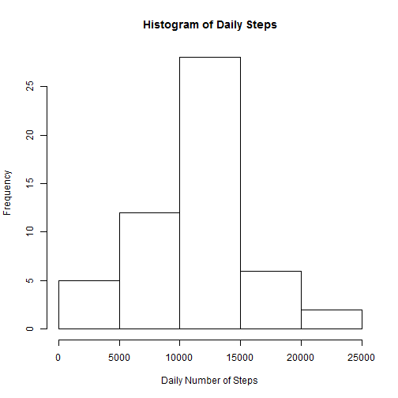
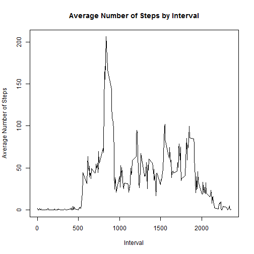
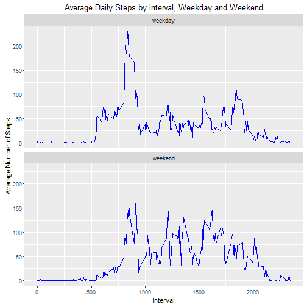

## Loading and preprocessing the data


```r
#load necessary libraries
library(dplyr)
```

```
## 
## Attaching package: 'dplyr'
```

```
## The following objects are masked from 'package:stats':
## 
##     filter, lag
```

```
## The following objects are masked from 'package:base':
## 
##     intersect, setdiff, setequal, union
```

```r
library(ggplot2)

#read activity data
data <- read.csv("~/R/activity.csv")

#sum total steps by date, removing NAs
step_day <- data %>% filter(steps != "NA") %>%
  group_by(date) %>% summarize(dailysteps = sum(steps))
```

Raw data is read into memory, and processed by removing NAs,  
grouping by date, and summing total steps by day.

## What is mean total number of steps taken per day?


```r
#create histogram of daily total steps
hist(step_day$dailysteps,main = "Histogram of Daily Steps",
     xlab="Daily Number of Steps")
```



```r
#calculate the mean and median daily steps
mean_steps <- format(round(mean(step_day$dailysteps),2),scientific=FALSE)
med_steps <- median(step_day$dailysteps)
```

The mean daily total steps: 10766.19  
The median daily total steps: 10765

## What is the average daily activity pattern?


```r
#average number of steps by interval, removing NAs
int_steps <- data %>% filter(is.na(steps) == FALSE) %>%
  group_by(interval) %>% summarize(intsteps = mean(steps))

#plot the average number of steps by interval
plot(int_steps$interval,int_steps$intsteps,type="l",xlab="Interval",
     ylab="Average Number of Steps",
     main="Average Number of Steps by Interval")
```



```r
#calculate the interval with the max average steps
max_steps <- int_steps[which(int_steps$intsteps==max(int_steps$intsteps)),]
max_int <- max_steps$interval
max_stp <- round(max_steps$intsteps,2)
```

The plot of interval steps shows that there is little activity for the first  
~500 intervals in each day, and peaks from ~800-950 intervals.  The max interval  
is at 835 with 206.17 steps on average.

Activity flucuates between 30-100 steps until about interval 2000, from which  
there is a steady decline towards zero.

## Imputing missing values


```r
#filter for NAs
nasteps <- data %>% filter(is.na(steps)==TRUE)

#count NAs in the data
num_nas <- nrow(nasteps)

#join original data to the table with inteval averages
#fill NAs with average steps of the interval
filled <- data %>% inner_join(int_steps) %>% 
  mutate(steps = ifelse(is.na(steps) == TRUE, intsteps, steps)) %>%
  select(steps,date,interval)
```

```
## Joining by: "interval"
```

```r
#sum the number of steps by day with the filled NA data
filled_day <- filled %>%
  group_by(date) %>% summarize(dailysteps = sum(steps))

#calculate mean and median of filled data
mean_fsteps <- format(round(mean(filled_day$dailysteps),2),scientific=FALSE)
med_fsteps <- format(round(median(filled_day$dailysteps),2),scientific=FALSE)
```

There are 2304 NA value for steps in the dataset.

To address this, I replaced NAs for each interval with the interval average  
of the non-NA values.

After replacing NAs, the mean number of steps was 10766.19,  
compared to 10766.19 with the NA values.

After replacing NAs, the median number of steps was 10766.19,  
compared to 10765 with the NA values.

Overall, replacing the NAs do not affect the mean, but pull up the median  
slightly.  Additionally, replacing the NAs add several data points at  
the mean, so the histogram is more tightly concentrated around the mean  
compared to the distribution without NA replacement.


## Are there differences in activity patterns between weekdays and weekends?


```r
#create field separating weekday from weekend, calculate average steps
#by interval and weekday/weekend
week_steps <- filled %>% 
  mutate(daytype = ifelse(weekdays(as.Date(as.character(date))) == "Saturday" |
                            weekdays(as.Date(as.character(date))) == "Sunday",
                          "weekend","weekday")) %>% 
  group_by(daytype, interval) %>% summarize(intsteps = mean(steps))

#plot average steps by interval, separated into weekdays and weekends
ggplot(data = week_steps, aes(x=interval, y=intsteps)) + 
  geom_line(color="blue") + facet_wrap(~daytype,ncol=1) +
  labs(title="Average Daily Steps by Interval, Weekday and Weekend",
       y = "Average Number of Steps", x="Interval")
```



There are differences in activity patterns between weekdays and weekends.  
On weekdays, there is a distinct spike in activity around 800-950 intervals,  
and the peak is over 200 steps.  However, on weekends, the activity is  
generally spread more evently throughout the day, and no interval averages  
over 200 steps.  Thus, weekdays are characterized by a short period of high  
step activity, followed by lower activity the rest of the day,   
while weekends are characterized by steadier activity throughout the day  
from intervals ~800-2000.
